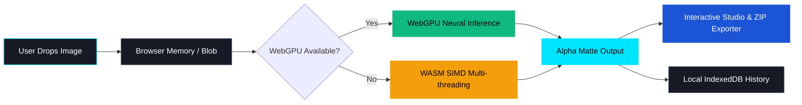

<div align="center">

# ✂️ EraseDrop
### **Next-Gen 100% In-Browser AI Background Remover**

*Free, Unlimited, Private-by-Design, and Hardware-Accelerated with WebGPU.*

[](https://erase-drop.vercel.app)
[](https://github.com/zzdree/erase-drop/stargazers)
[](https://opensource.org/licenses/MIT)
[](https://erase-drop.vercel.app)
[](https://erase-drop.vercel.app)

<br />

### 🌐 **Live Website:** [https://erase-drop.vercel.app](https://erase-drop.vercel.app)

<br />

<p align="center">
  <a href="#-key-features">Key Features</a> •
  <a href="#-how-it-works--privacy-guarantee">Privacy & Architecture</a> •
  <a href="#-formal-pas-foto-presets">Pas Foto Presets</a> •
  <a href="#-tech-stack">Tech Stack</a> •
  <a href="#-getting-started">Getting Started</a> •
  <a href="#-deployment">Deployment</a>
</p>

---

</div>

## 💡 What is EraseDrop?

**EraseDrop** is an ultra-fast, zero-server image background removal web application. Unlike traditional background removers that require costly subscriptions, token credits, or upload your private photos to remote cloud servers, **EraseDrop runs state-of-the-art neural network matting directly inside your browser**.

Everything stays inside your machine. No accounts, no watermarks, no limits.

---

## ✨ Key Features

<table>
  <tr>
    <td width="50%">
      <h3>🔒 100% On-Device Privacy</h3>
      <p>Zero byte sent across the internet. Images are segmented directly inside your browser memory using WebAssembly & WebGPU.</p>
    </td>
    <td width="50%">
      <h3>⚡ WebGPU Hardware Acceleration</h3>
      <p>Blazing-fast inference speeds (1–3 seconds per photo) leveraging your local GPU, with automatic fallback to multithreaded WASM SIMD.</p>
    </td>
  </tr>
  <tr>
    <td width="50%">
      <h3>📦 Unlimited Batch Processing</h3>
      <p>Drop 10, 50, or 100+ photos simultaneously. Progress is tracked per-item with a 1-click <strong>Download All ZIP</strong> exporter.</p>
    </td>
    <td width="50%">
      <h3>🎨 Interactive Backdrop Studio</h3>
      <p>Fine-tune results with a real-time split slider (Before vs After), solid colors, custom studio gradients, or custom background photos.</p>
    </td>
  </tr>
  <tr>
    <td width="50%">
      <h3>🇮🇩 Formal Pas Foto Presets</h3>
      <p>Instant 1-click background colors for Indonesian official documents: <strong>Red (#D61C1C)</strong> for odd birth years and <strong>Blue (#1C54D6)</strong> for even birth years.</p>
    </td>
    <td width="50%">
      <h3>💾 Offline Local History</h3>
      <p>Processed images are cached locally in your browser's <strong>IndexedDB</strong> for instant re-download without consuming cloud storage.</p>
    </td>
  </tr>
</table>

---

## 🛡️ How It Works & Privacy Guarantee



> **Security Note:** EraseDrop operates strictly with client-side isolation. You can disconnect your internet after loading the page, and the background remover will continue to work seamlessly offline.

---

## 📸 Formal Pas Foto Presets

EraseDrop includes calibrated color presets specifically tailored for job applications, CPNS, visa applications, and government identity cards:

| Preset Name | Color Hex | Official Usage |
| :--- | :---: | :--- |
| **Merah Formal** | `#D61C1C` | Pas Foto KTP / Ijazah / Dokumen Resmi (Tahun Kelahiran Ganjil) |
| **Biru Formal** | `#1C54D6` | Pas Foto KTP / Ijazah / Dokumen Resmi (Tahun Kelahiran Genap) |
| **Studio Putih** | `#FFFFFF` | E-Commerce Product Catalog, Visa Internasional |
| **Studio Abu-Abu** | `#E2E8F0` | LinkedIn Corporate Headshots, Clean Minimalist Portfolio |
| **Charcoal Dark** | `#1E293B` | Modern Professional Dark Theme Headshots |

---

## 🛠️ Tech Stack & Dependencies

- **Core Framework:** [React 18](https://react.dev/) + [TypeScript](https://www.typescriptlang.org/) + [Vite](https://vitejs.dev/)
- **Styling & Design System:** [Tailwind CSS v4](https://tailwindcss.com/)
- **AI Inference Engine:** [`@imgly/background-removal`](https://github.com/imgly/background-removal-js) via ONNX Runtime Web
- **Batch Archiving:** [`JSZip`](https://stuk.github.io/jszip/) & [`file-saver`](https://github.com/eligrey/FileSaver.js/)
- **Icons & Visuals:** [`lucide-react`](https://lucide.dev/) & [`canvas-confetti`](https://www.npmjs.com/package/canvas-confetti)
- **Local Persistence:** Native Browser IndexedDB

---

## 💻 Getting Started

### Prerequisites
- [Node.js](https://nodejs.org/) version 18+ or 20+
- Modern Web Browser (Google Chrome, Microsoft Edge, Safari, Firefox, or Brave)

### Installation

```bash
# 1. Clone the repository
git clone https://github.com/zzdree/erase-drop.git

# 2. Enter project directory
cd erase-drop

# 3. Install dependencies
npm install

# 4. Start local development server
npm run dev
```

Open `http://localhost:5173` in your browser to start removing backgrounds locally.

---

## 🚀 Deployment

- **Production URL:** [https://erase-drop.vercel.app](https://erase-drop.vercel.app)
- **Deployment Platform:** Vercel

```bash
# Deploy updates via CLI
npx vercel --prod
```

---

## 📄 Documentation

- [Product Requirements Document (PRD.md)](./PRD.md)
- [Design System & UI Tokens (DESIGN.md)](./DESIGN.md)

---

## 👨‍💻 Author & Maintainer

**Andreas Restuawanta Christwara**  
- GitHub: [@zzdree](https://github.com/zzdree)
- Repository: [zzdree/erase-drop](https://github.com/zzdree/erase-drop)

---

<div align="center">
  <sub>Built with ❤️ for privacy, efficiency, and creators worldwide.</sub>
</div>
