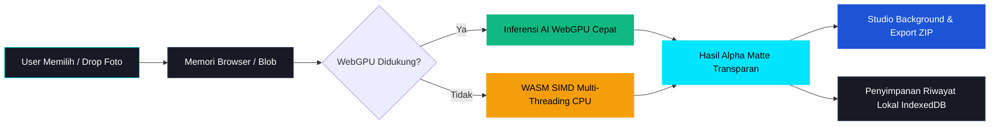

<div align="center">

# ✂️ EraseDrop
### **Penghapus Background Gambar Berbasis AI 100% di Dalam Browser**

*Gratis, Tanpa Batas, Menjaga Privasi Penuh, dan Dipercepat oleh WebGPU.*

[](https://erase-drop.vercel.app)
[](https://github.com/zzdree/erase-drop/stargazers)
[](https://opensource.org/licenses/MIT)
[](https://erase-drop.vercel.app)
[](https://erase-drop.vercel.app)

<br />

### 🌐 **Akses Website Langsung:** [https://erase-drop.vercel.app](https://erase-drop.vercel.app)

<br />

<p align="center">
  <a href="#-tentang-erasedrop">Tentang</a> •
  <a href="#-fitur-utama">Fitur Utama</a> •
  <a href="#-cara-kerja--jaminan-privasi">Cara Kerja & Privasi</a> •
  <a href="#-preset-warna-pas-foto-resmi-indonesia">Preset Pas Foto</a> •
  <a href="#-teknologi-yang-digunakan">Teknologi</a> •
  <a href="#-panduan-instalasi-lokal">Instalasi Lokal</a> •
  <a href="#-deployment">Deployment</a>
</p>

---

</div>

## 💡 Tentang EraseDrop

**EraseDrop** adalah aplikasi web penghapus latar belakang gambar modern yang bekerja tanpa server (*zero-server upload*). Berbeda dengan aplikasi penghapus background konvensional yang memungut biaya langganan, sistem token/kredit, atau mengunggah foto pribadi Anda ke server cloud, **EraseDrop menjalankan model kecerdasan buatan (*neural network matting*) langsung di dalam browser perangkat Anda**.

Seluruh file foto tetap berada di perangkat Anda secara aman. Tanpa login akun, tanpa watermark, dan tanpa batasan kuota.

---

## ✨ Fitur Utama

<table>
  <tr>
    <td width="50%">
      <h3>🔒 100% Privasi di Perangkat</h3>
      <p>Tidak ada 1 byte pun data foto yang dikirim ke internet. Pemotongan background dieksekusi langsung di memori browser Anda menggunakan WebAssembly & WebGPU.</p>
    </td>
    <td width="50%">
      <h3>⚡ Akselerasi Hardware WebGPU</h3>
      <p>Proses pemotongan subjek super cepat (1–3 detik per foto) memanfaatkan GPU lokal perangkat, dengan fallback otomatis ke WASM SIMD multi-threading.</p>
    </td>
  </tr>
  <tr>
    <td width="50%">
      <h3>📦 Batch Processing Tanpa Batas</h3>
      <p>Masukkan 10, 50, hingga 100+ foto sekaligus. Progress dipantau secara real-time per gambar dan dapat diunduh sekaligus dalam format <strong>ZIP 1-Klik</strong>.</p>
    </td>
    <td width="50%">
      <h3>🎨 Studio & Editor Background Interaktif</h3>
      <p>Bandingkan detail potongan secara presisi dengan slider <em>Before vs After</em>, ganti latar belakang menjadi warna solid, gradien studio, atau foto custom.</p>
    </td>
  </tr>
  <tr>
    <td width="50%">
      <h3>🇮🇩 Preset Warna Pas Foto Resmi</h3>
      <p>1-Klik ganti latar belakang pas foto formal dokumen Indonesia: <strong>Merah (#D61C1C)</strong> untuk tahun lahir ganjil & <strong>Biru (#1C54D6)</strong> untuk tahun lahir genap.</p>
    </td>
    <td width="50%">
      <h3>💾 Riwayat Offline Lokal (IndexedDB)</h3>
      <p>Hasil foto tersimpan di penyimpanan lokal browser Anda (<strong>IndexedDB</strong>) sehingga dapat diunduh kembali kapan saja tanpa memakan ruang server.</p>
    </td>
  </tr>
</table>

---

## 🛡️ Cara Kerja & Jaminan Privasi



> **Catatan Keamanan:** EraseDrop beroperasi dengan isolasi penuh pada sisi klien (*client-side*). Anda bahkan dapat mematikan koneksi internet setelah website dimuat, dan aplikasi akan tetap berfungsi normal secara offline.

---

## 📸 Preset Warna Pas Foto Resmi Indonesia

EraseDrop menyediakan preset warna terkalibrasi khusus untuk kebutuhan dokumen resmi Indonesia, lamaran kerja, CPNS, visa, dan administrasi:

| Nama Preset | Kode Hex | Penggunaan Resmi |
| :--- | :---: | :--- |
| **Merah Formal** | `#D61C1C` | Pas Foto KTP / Ijazah / Dokumen Resmi (**Tahun Kelahiran Ganjil**) |
| **Biru Formal** | `#1C54D6` | Pas Foto KTP / Ijazah / Dokumen Resmi (**Tahun Kelahiran Genap**) |
| **Studio Putih** | `#FFFFFF` | Katalog Produk E-Commerce, Pengajuan Visa Internasional |
| **Studio Abu-Abu** | `#E2E8F0` | Foto Profil LinkedIn, Portfolio Minimalis & Profesional |
| **Charcoal Gelap** | `#1E293B` | Foto Profil Modern Dark Theme |

---

## 🛠️ Teknologi yang Digunakan

- **Framework Utama:** [React 18](https://react.dev/) + [TypeScript](https://www.typescriptlang.org/) + [Vite](https://vitejs.dev/)
- **Desain & Styling:** [Tailwind CSS v4](https://tailwindcss.com/)
- **Mesin Inferensi AI:** [`@imgly/background-removal`](https://github.com/imgly/background-removal-js) melalui ONNX Runtime Web
- **Batch ZIP Exporter:** [`JSZip`](https://stuk.github.io/jszip/) & [`file-saver`](https://github.com/eligrey/FileSaver.js/)
- **Ikon & Visual:** [`lucide-react`](https://lucide.dev/) & [`canvas-confetti`](https://www.npmjs.com/package/canvas-confetti)
- **Penyimpanan Lokal:** Browser Native IndexedDB

---

## 💻 Panduan Instalasi Lokal

### Prasyarat
- [Node.js](https://nodejs.org/) versi 18+ atau 20+
- Browser modern (Google Chrome, Microsoft Edge, Safari, Firefox, atau Brave)

### Langkah Menjalankan

```bash
# 1. Clone repositori dari GitHub
git clone https://github.com/zzdree/erase-drop.git

# 2. Masuk ke direktori proyek
cd erase-drop

# 3. Install seluruh dependensi
npm install

# 4. Jalankan server lokal development
npm run dev
```

Buka `http://localhost:5173` di browser Anda untuk mulai menghapus background gambar secara lokal.

---

## 🚀 Deployment

- **Production URL:** [https://erase-drop.vercel.app](https://erase-drop.vercel.app)
- **Platform:** Vercel

```bash
# Deploy pembaruan via Vercel CLI
npx vercel --prod
```

---

## 📄 Dokumentasi Proyek

- [Product Requirements Document (PRD.md)](./PRD.md)
- [Design System & UI Tokens (DESIGN.md)](./DESIGN.md)

---

## 👨‍💻 Pengembang & Pemilik Proyek

**Andreas Restuawanta Christwara**  
- GitHub: [@zzdree](https://github.com/zzdree)
- Repositori: [zzdree/erase-drop](https://github.com/zzdree/erase-drop)

---

<div align="center">
  <sub>Dibuat dengan ❤️ untuk privasi, efisiensi, dan kemudahan para kreator & pengguna di seluruh dunia.</sub>
</div>
